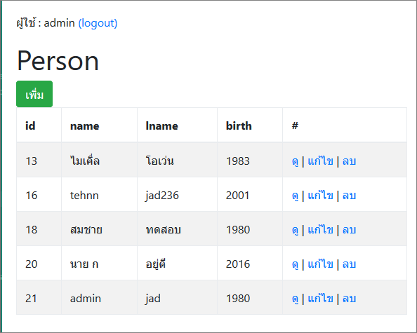

# NODEJS (ExpressJS Framework) CRUD Example




## Installation
```
# npm i
# restore db_example.sql to mysql
```

## Configuration
```
# config/db.json
```

## Test
```
browser:  http://localhost:3000
login :  admin , 112233

```


